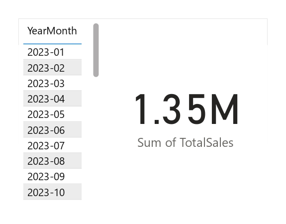

# 📊 Power BI Sales Dashboard

This project is an interactive sales dashboard built using Microsoft Power BI.  
It visualizes sales performance, top products, and trends using dynamic visuals and metrics.

---

## 📁 Project Structure

| File/Folder                    | Description                                           |
|-------------------------------|--------------------------------------------------------|
| `Project.pbix`                | Main Power BI report file                             |
| `Sample_Sales_Data.xlsx`      | Excel file used as the data source                    |
| `images/`                     | Contains dashboard screenshots                        |

---

## ✨ Key Features

- Monthly and YoY sales performance
- Top-selling products and categories
- KPI cards and interactive filtering
- Dynamic date/time-based analysis
- Power Query and DAX-based transformations

---

## 🧠 Technologies Used

- **Power BI Desktop**
- **Power Query (M)**
- **DAX (Data Analysis Expressions)**
- **Excel (for data source)**

---

## 🖼️ Dashboard Previews

Below are snapshots of the report pages and visuals from the dashboard:

| Page 1 | Page 2 | Page 3 |
|--------|--------|--------|
|  |  |  |

| Page 4 | Page 5 | Page 6 |
|--------|--------|--------|
|  |  |  |

| Page 7 | Page 8 | Page 9 |
|--------|--------|--------|
|  |  |  |

| Page 10 |
|----------|
|  |

---

## 🚀 How to Run the Project

1. Open the file `Project.pbix` using Power BI Desktop.
2. If prompted, reconnect the Excel data source by browsing to `Sample_Sales_Data.xlsx` in the same folder.
3. Interact with the visuals, filters, and KPIs.

---

## 🔍 Sample DAX Measures

```dax
Total Sales = SUM(Sales[Amount])

Sales Last Year = 
    CALCULATE([Total Sales], SAMEPERIODLASTYEAR('Date'[Date]))

YoY Growth % = 
    DIVIDE([Total Sales] - [Sales Last Year], [Sales Last Year])

---

## 🎯 Project Objective

The goal of this dashboard is to help business stakeholders:

- Monitor sales performance across time
- Identify top-performing products
- Analyze trends and make data-driven decisions
- Track key metrics using interactive visualizations

---

## 💻 Requirements

- [Power BI Desktop](https://powerbi.microsoft.com/en-us/desktop/) (Latest version)
- Windows OS (Power BI doesn't work natively on macOS)

---

## 👩‍💻 Author

**Engy Mohamed**  

[LinkedIn](www.linkedin.com/in/engy-hanafy-8118a8330) | [Email](mailto: eng.engymohamed33@gmail.com)
